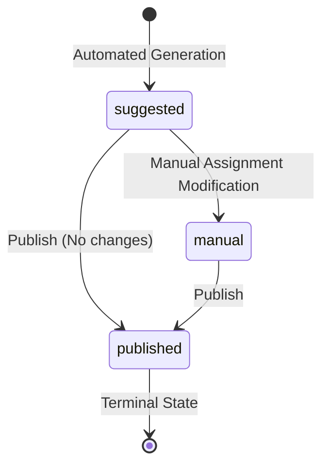

# Phase 4B — Distribution Management & Lifecycle Business Rules Specification

## Executive Summary
This document formally defines the business rules governing the lifecycle, approval, publication, and modification of Clinical Distribution Versions within the Clinical Department Management System (CDMS). It acts as the definitive specification for Phase 4B implementation, building upon the automated generation engine (Phase 3B) and manual assignment foundation (Phase 4A) already established. 

## Scope
This specification applies **only** to the business operations involved in taking a generated or manually modified `DistributionVersion` and transitioning it through approval and formal publication. It covers lifecycle state transitions, conflict resolution, authorization matrices, audit trails, and concurrency safety. It **does not** cover UI implementation, automated algorithm changes, or database migrations (unless explicitly specified for future phases).

---

## Existing System Baseline
The current Phase 3B and Phase 4A system behaviors are authoritative:
- **Phase 3B**: The engine generates automated candidate assignments deterministically without DB queries, creating a `DistributionVersion` with `status = suggested`. Hard constraints (capacity, overlaps, academic eligibility) are strictly enforced. Supervisor assignments are intentionally deferred.
- **Phase 4A**: A manual CRUD API allows modification of assignments. This transitions the version to `status = manual`. Hard constraints are enforced during manual modifications but can be bypassed with `force = true` + `override_reason` + `distribution.override` permission. Scoped bindings prevent cross-version manipulation. Published versions are currently immutable.

---

## Terminology
- **Distribution Version**: A proposed mapping of students to rotation blocks and sites for a given Rotation.
- **Automated Constraint**: A rule enforced automatically by the validation engine (e.g., site capacity, academic eligibility).
- **Authorized Override**: A deliberate bypass of a hard constraint by an administrator holding specific permissions, requiring a documented reason.
- **Unassigned Student**: A student who belongs to the rotation's academic year but lacks a valid placement in the version.
- **Distribution Conflict**: An impossibility generated by the automated engine (e.g., `PARTIAL_IMPOSSIBLE`) indicating unresolvable capacity or overlap issues.

---

## Business Rules

### 1. State Machine & Version Lifecycle
The lifecycle of a `DistributionVersion` progresses linearly with specific branches for manual intervention.

*Note: A `draft` status is not currently implemented for distributions (as generations are immediately complete `suggested` versions). Approval is treated as an authorization event rather than a distinct database state (see Approval Rules).*

### 2. Approval Rules
**Decision**: "Approval" is an authorization event and precondition for publication, **not** a distinct database status.
- **Who**: Users with `distribution.approve` permission.
- **Action**: An explicit API call to mark a version as "Approved by [User]" internally, logged heavily in the `AuditLog`.
- **Preconditions**: All hard constraints must pass or have authorized overrides.
- **Revocation**: Any manual modification (`assignment.created`, `updated`, `deleted`) to a version **automatically revokes** its prior approval. It must be re-approved.
- **Unassigned Students**: A version *can* be approved with unassigned students if an override is provided.

### 3. Publication Rules
Publication is the critical business action that makes a Distribution Version officially active and visible to students/supervisors.
- **Required Permission**: `distribution.publish`.
- **Preconditions**:
  - The version must be `suggested` or `manual`.
  - The version must have been formally "Approved" (audit event exists and hasn't been revoked).
  - A final validation pipeline must pass successfully in-memory.
- **Unassigned Students**: Allowed **only** if explicitly authorized by an override reason during publication.
- **Supervisors**: Supervisor assignment is **not** mandatory for publication. (Supervisors can be assigned post-publication or deferred entirely).
- **Transaction**: The entire publication state change must occur within a strict database transaction.

### 4. Conflict Rules
- **Engine Conflicts**: `DistributionConflict` records (e.g., `UNASSIGNABLE`) generated in Phase 3B do not inherently block publication, provided the administrator acknowledges them via an override.
- **Resolution**: A conflict is considered "resolved" if the student it pertains to receives a valid manual assignment. 
- **Audit**: Conflicts are preserved in the DB for historical record; modifying an assignment associated with a conflict does not delete the conflict record but renders it operationally moot.

### 5. Supervisor Rules
- **Mandatory Status**: Supervisor assignments are **optional** prior to publication.
- **Granularity**: Supervisors are assigned at the individual `StudentClinicalAssignment` level.
- **Capacity**: No supervisor capacity limits exist in the current business context.
- **Post-Publication**: Supervisors **can** be assigned or modified *after* publication. This is the **only** field on a published assignment that can be mutated, as it does not affect the student's geographic/temporal placement.

### 6. Override Rules
- **Hard Constraints**: Constraints like site capacity, rotation block overlaps, and academic year compatibility are strict.
- **Bypassing**: Can only be bypassed via `force = true` + `override_reason` + `distribution.override` permission.
- **Publication Bypassing**: If publishing a version with unassigned students, a global override reason must be provided by the publisher.

### 7. Published Version Immutability
- **Rule**: A `DistributionVersion` with `status = published` is strictly immutable regarding student placements (site, block, subgroup).
- **Corrections**: If a clinical placement must change after publication, the system does **not** revert the published version. Instead, a completely **new** version must be generated/cloned, corrected, approved, and published.
- **Supersession**: Publishing Version B automatically supersedes a previously published Version A for the same Rotation. Version A remains in the database (status remains `published`, but the application logic must query the *latest* published version by `created_at` or a new `is_current` flag in a future schema update).

### 8. Audit Rules
The `AuditLog` must capture the following lifecycle events:
- `version.approved` (Records user, version ID)
- `version.approval_revoked` (Triggered automatically upon assignment mutation)
- `version.published` (Records user, version ID, and any global override reasons for unassigned students)
- `version.superseded` (Records when a new version replaces an old one)
- `assignment.supervisor_updated` (For post-publication supervisor assignments)

---

## Validation Pipeline (Before Approval/Publication)
1. Load `DistributionVersion`.
2. Verify Status (`suggested` or `manual`).
3. Verify Authorization (`distribution.approve` or `distribution.publish`).
4. Load all `StudentClinicalAssignments`.
5. Execute `DistributionValidationService` (O(1) optimal querying).
6. Verify Supervisor Requirements (Skip - Optional).
7. Flag Unassigned Students.
8. If Unassigned Students exist OR Validation throws Hard Constraints:
   - Reject unless `force = true`, `override_reason` exists, and user has `distribution.override`.
9. Produce Final Validation Result.

---

## Transaction & Concurrency Rules
- **Publication Transaction**: The transition to `published` must be wrapped in `DB::transaction()`. If any step (status update, audit logging, superseding old versions) fails, the entire operation rolls back.
- **Concurrency (Race Conditions)**: 
  - To prevent User A from publishing while User B edits, `updateAssignment` will increment a `version_hash` or `updated_at` timestamp on the `DistributionVersion`.
  - The Publish endpoint must accept a `last_updated_at` parameter. If the version has been modified since the client loaded it, publication is rejected with HTTP 409 Conflict.

---

## Version Comparison (MVP Definition)
- **Requirement**: Required for MVP to allow approvers to understand what changed between automated generation and manual intervention.
- **Business Behavior**: The API must provide an endpoint that compares the target `DistributionVersion` against the automated baseline or a previously published version, outputting a diff array of: `students_moved`, `students_unassigned`, `students_manually_assigned`.

---

## RBAC Matrix

| Action | Permission | Allowed Status | Restrictions |
| :--- | :--- | :--- | :--- |
| Create/Update/Delete Assignment | `distribution.update` | `suggested`, `manual` | Mutates status to `manual`; revokes approval. |
| Override Constraints | `distribution.override` | `suggested`, `manual` | Requires `force` and `override_reason`. |
| Approve Version | `distribution.approve` | `suggested`, `manual` | Blocked if invalid unless overridden. |
| Publish Version | `distribution.publish` | `suggested`, `manual` | Must be approved. Cannot be modified after. |
| Update Supervisor | `distribution.update` | `published` | Only the `supervisor_id` field can be modified. |

---

## Error Semantics
- `VALIDATION_FAILED`: Hard constraints failed; no override provided.
- `APPROVAL_REQUIRED`: Attempted to publish a version lacking an active approval audit event.
- `APPROVAL_REVOKED`: A modification occurred after approval.
- `VERSION_ALREADY_PUBLISHED`: Attempted to modify a published version's placements.
- `OVERRIDE_REASON_REQUIRED`: Attempted to force a validation bypass without documentation.
- `CONCURRENCY_CONFLICT`: The version was modified by another user during the approval/publish flow.

---

## Comprehensive Rule Matrix

| ID | Category | Rule | Trigger | Precondition | Action | Blocking? | Override Allowed? | Required Permission | Audit Required |
| :--- | :--- | :--- | :--- | :--- | :--- | :--- | :--- | :--- | :--- |
| 4B-VR-001 | Lifecycle | Assignment mutation changes version status to `manual`. | Update/Create/Delete Assignment | Status is `suggested` | Change status to `manual` | No | N/A | `distribution.update` | Yes |
| 4B-AP-001 | Approval | Approval marks version as ready for publication. | Approve API call | Validation passes / Overridden | Log `version.approved` | Yes | Yes | `distribution.approve` | Yes |
| 4B-AP-002 | Approval | Modifying an assignment revokes existing approval. | Update/Create/Delete Assignment | Version has active approval | Log `version.approval_revoked` | No | N/A | `distribution.update` | Yes |
| 4B-PU-001 | Publication | Publishing locks the version from placement mutations. | Publish API call | Version is approved | Change status to `published`, supersede older | Yes | Yes | `distribution.publish` | Yes |
| 4B-PU-002 | Publication | Unassigned students block publication unless overridden. | Publish API call | Unassigned students exist | Reject request | Yes | Yes | `distribution.override` | Yes |
| 4B-SV-001 | Supervisor | Supervisors can be updated on published versions. | Update Supervisor API | Status is `published` | Update `supervisor_id` only | No | N/A | `distribution.update` | Yes |
| 4B-RB-001 | Concurrency | Publication fails if version was modified mid-flight. | Publish API call | `last_updated_at` mismatch | Return 409 Conflict | Yes | No | `distribution.publish` | No |

---

## Open Business Decisions

1. **Current Version Designation Schema**
   - *Decision*: How does the application quickly query the "active" published version when multiple exist?
   - *Why it matters*: Querying by `MAX(created_at)` where `status = published` is functional but risks performance issues at scale or logic errors if historical corrections occur out of order.
   - *Recommended Option*: Add a boolean `is_current` column to `distribution_versions` in a future migration (outside Phase 4B scope, handle via `MAX(created_at)` for now).
   - *Consequence*: Slight technical debt requiring a future schema update.

2. **Supervisor Notifications**
   - *Decision*: Should supervisors receive automated notifications when a version is published or a post-publication assignment is made?
   - *Why it matters*: Communication is vital, but automated emailing requires queue infrastructure.
   - *Recommended Option*: Defer automated notifications to Phase 5.
   - *Consequence*: Clinical admin must manually communicate assignments for now.

---

## Phase 4B Implementation Readiness

| Area | Status |
| :--- | :--- |
| Version Lifecycle | **READY** |
| Approval Workflow | **READY** |
| Publication Workflow | **READY** |
| Conflict Resolution | **READY** |
| Supervisor Handling | **READY** |
| Audit Trail | **READY** |
| RBAC | **READY** |
| Validation | **READY** |
| Concurrency | **READY** |
| Version Comparison | **READY** |
| Post-publication Corrections | **READY AFTER BUSINESS DECISION** (Requires DB schema decision on `is_current`) |

### Final Recommendation
The business rules for Phase 4B are fully specified and structurally sound, strictly adhering to the architectural foundations laid in Phase 3B and Phase 4A. The system is **READY** for Phase 4B API implementation.
